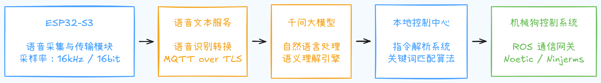
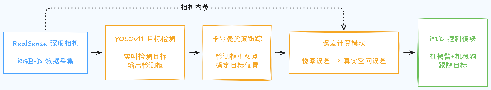

# Awesome Quadruped Locomotion 🐕‍🦺  
四足狗（Go2 / Go1 / A1 / Solo12 …）学习与实战总览

> 目标：帮你从 **“装好仿真环境” → “跑出 RL 策略” → “部署到真机四足狗”** 走完一条闭环路径。  
> 重点聚焦：**Unitree Go2 / Go1 系列**，同时兼顾 ODRI Solo12 等开源平台。

---

## 目录

- [Awesome Quadruped Locomotion 🐕‍🦺](#awesome-quadruped-locomotion-)
  - [目录](#目录)
  - [0. 适用对象 \& 使用方式](#0-适用对象--使用方式)
  - [1. 通用训练框架 / 环境（腿足与人形共用）](#1-通用训练框架--环境腿足与人形共用)
  - [2. 厂商 / 平台套件（面向 Go2 / H1 等）](#2-厂商--平台套件面向-go2--h1-等)
  - [3. 四足机器人按目标场景汇总](#3-四足机器人按目标场景汇总)
    - [3A. 速度 / 姿态跟踪（平地 / 粗糙地形）](#3a-速度--姿态跟踪平地--粗糙地形)
    - [3B. 越障 / 跑酷（敏捷动作与安全约束）](#3b-越障--跑酷敏捷动作与安全约束)
    - [3C. 视觉导航（Exteroceptive Locomotion）](#3c-视觉导航exteroceptive-locomotion)
    - [3D. 起身恢复 / 跌倒恢复](#3d-起身恢复--跌倒恢复)
    - [3E. ODRI Solo12 / Bolt 等开源平台](#3e-odri-solo12--bolt-等开源平台)
  - [4. 部署与工程化（从仿真到真机）](#4-部署与工程化从仿真到真机)
  - [5. 针对不同硬件的“快速上手清单”](#5-针对不同硬件的快速上手清单)
    - [5.1 Go2 / Go1 系列 ✅（重点）](#51-go2--go1-系列-重点)
    - [5.2 ODRI Solo12 ✅](#52-odri-solo12-)
    - [5.3 ODRI Bolt（小型双足）](#53-odri-bolt小型双足)
  - [6. Xdog项目专栏](#6-xdog项目专栏)
    - [6.1 xdog功能介绍](#61-xdog功能介绍)
    - [6.2 xdog视觉伺服以及语音控制模块](#62-xdog视觉伺服以及语音控制模块)
    - [6.3 xdog强化simtoreal实现逻辑](#63-xdog强化simtoreal实现逻辑)
  - [7. 更多参考 / 综述清单](#7-更多参考--综述清单)

---

## 0. 适用对象 & 使用方式

**适合谁？**

- 有 / 准备有：Go2 / Go1 / A1 / Solo12 等四足平台
- 想要：
  - 在 **Isaac Gym / Isaac Lab / Legged Gym** 里训练四足行走策略
  - 做 **越障 / 跑酷 / 视觉导航 / 起身恢复** 等高级技能
  - 最终把策略 **部署到真机** 上跑起来

**怎么用这个 README？**

- 当作一个 **带标签的资源索引**：
  - 想做“平地&粗糙地形速度跟踪” → 看 [3A](#3a-速度--姿态跟踪平地--粗糙地形)
  - 想做“跑酷/越障” → 看 [3B](#3b-越障--跑酷敏捷动作与安全约束)
  - 想做“视觉导航 + 行走” → 看 [3C](#3c-视觉导航exteroceptive-locomotion)
  - 想做“起身恢复” → 看 [3D](#3d-起身恢复--跌倒恢复)
- 如果你是 **Go2/H1 直接用户**，可以重点参考 [2](#2-厂商--平台套件面向-go2--h1-等) + [5.1](#51-go2--go1-系列)。

---

## 1. 通用训练框架 / 环境（腿足与人形共用）

> 这些是“**所有四足/人形 RL 项目几乎都会碰一下的基础设施**”。

- **Legged Gym（ETH RSL）**  
  - 四足 / 多足 RL 环境，基于 Isaac Gym，带粗糙地形、域随机化、推挤扰动等；大量论文直接以此为基线。  
  - 代码：  
    https://github.com/leggedrobotics/legged_gym  

- **Isaac Gym Envs / Isaac Lab（官方统一框架）**  
  - Isaac Gym 示例环境 + Isaac Lab（后续统一框架）：  
    - 原生支持人形 / 四足任务  
    - 官方集成 RSL-RL、skrl、RL-Games 等训练脚本  
  - 链接：  
    - Envs：https://github.com/isaac-sim/IsaacGymEnvs  
    - Isaac Lab 文档：https://isaac-sim.github.io/IsaacLab/  
    - Isaac Lab 仓库：https://github.com/isaac-sim/IsaacLab  

- **RSL-RL**（ETH RSL 高效 PPO 库，GPU 端到端）  
  - 基本是 Legged Gym / Isaac 系列的“标配 RL 引擎”。  
  - 代码：  
    https://github.com/leggedrobotics/rsl_rl  

- **skrl**（面向 Isaac Gym / Isaac Lab / Gymnasium 的 PyTorch RL 库）  
  - 示例丰富、入门友好，官方文档里有专门的 Isaac Lab 集成。  
  - 文档与示例：  
    https://skrl.readthedocs.io/en/latest/intro/examples.html  
  - Isaac Lab 集成说明：  
    https://skrl.readthedocs.io/en/latest/api/envs/isaaclab.html  

---

## 2. 厂商 / 平台套件（面向 Go2 / H1 等）

> 如果你用的是 **Unitree 系列（Go2 / H1 / G1）**，可以优先踩这里，少走弯路。

- **Unitree RL Gym**  
  - 面向 Go2 / H1 / H1_2 / G1 的 RL 实现，支持 Isaac Gym、MuJoCo，附带物理部署链路。  
  - 仓库：  
    https://github.com/unitreerobotics/unitree_rl_gym  
  - Unitree 开源汇总页：  
    https://www.unitree.com/mobile/opensource  

- **Unitree RL Lab**  
  - 基于 Isaac Lab 的官方 RL 环境集：Go2、H1、G1-29DoF 等，便于和 Isaac 生态打通。  
  - 仓库：  
    https://github.com/unitreerobotics/unitree_rl_lab  

- **Unitree Sim IsaacLab**  
  - Unitree 机器人在 Isaac Lab 的模拟 / 数据采集与验证仓。  
  - 和真实机 DDS 协议一致，Sim→Real 迁移会更顺。  
  - 仓库：  
    https://github.com/unitreerobotics/unitree_sim_isaaclab  

---

## 3. 四足机器人按目标场景汇总

### 3A. 速度 / 姿态跟踪（平地 / 粗糙地形）

> 最典型的“跑起来就行”的 RL 任务——平地/坡地/随机地形速度跟踪。

- **Legged Gym 基线任务**  
  - 支持平地速度跟踪、粗糙地形行走（域随机化、噪声、推挤），Sim2Real 已被反复验证。  
  - 仓库：  
    https://github.com/leggedrobotics/legged_gym  

- **Walk These Ways（MoB，多行为泛化，Go1）**  
  - 在 Go1 上用 PPO + 多行为（MoB）学多种 gait，内含部署到 Go1 的 SDK 桥接。  
  - 仓库：  
    https://github.com/Improbable-AI/walk-these-ways  

- **skrl / Isaac Lab 速度跟踪任务示例**  
  - A1 / ANYmal 等四足的速度跟踪任务示例与训练脚本。  
  - 文档：  
    https://skrl.readthedocs.io/en/latest/intro/examples.html  
  - Isaac Lab 可用环境列表：  
    https://isaac-sim.github.io/IsaacLab/main/source/overview/environments.html  

---

### 3B. 越障 / 跑酷（敏捷动作与安全约束）

> 当你不满足于“在平地跑”，而是想做 **越障、台阶、跑酷 + 安全约束**。

- **ABS（Agile-But-Safe，RSS 2024）**  
  - 针对高速无碰撞越障的约束式 RL（基于 RSL-RL / Legged Gym 生态）。  
  - 仓库：  
    https://github.com/LeCAR-Lab/ABS  

- **Robot Parkour Learning / 四足跑酷方向**  
  - 跑酷学习系统（论文 + 示例），强调多样、视觉引导的敏捷技能。  
  - 总览页：  
    https://robot-parkour.github.io/  
  - 论文 PDF（PMLR）：  
    https://proceedings.mlr.press/v229/zhuang23a/zhuang23a.pdf  
  - Science Robotics 版的敏捷导航：  
    https://www.science.org/doi/10.1126/scirobotics.adi7566  

- **ViNL（Visual Navigation & Locomotion over Obstacles, ICRA 2023）**  
  - 把视觉导航（Habitat 训练）与越障行走（Isaac 训练）拼接，给出端到端示例。  
  - 仓库：  
    https://github.com/SimarKareer/ViNL  

---

### 3C. 视觉导航（Exteroceptive Locomotion）

> 不再“闭着眼走路”，而是结合 **高度图 / 点云 / RGB 视觉** 做外感知行走。

- **Robust Perceptive Locomotion（Science Robotics 2022）**  
  - 融合外感知（高度图 / 点云）与本体感知的鲁棒行走管线，ANYmal 野外徒步示范。  
  - 项目页：  
    https://leggedrobotics.github.io/rl-perceptiveloco/  

- **面向低成本平台的外感知 RL 行走（2025）**  
  - 同时训练策略与状态估计器，支持实时高程图构建。  
  - 论文：  
    https://arxiv.org/html/2505.12537v1  

- **Go1 视觉 / 导航实用栈（ROS2 Nav2）**  
  - 非 RL，但可以与学到的行走策略对接，用于全栈导航。  
  - 仓库：  
    https://github.com/ngmor/unitree_nav  

---

### 3D. 起身恢复 / 跌倒恢复

> 真机一定会摔，**“站起来”** 是工业落地前绕不过去的一环。

- **四足恢复策略（2019 经典工作）**  
  - 分层 RL 学到的恢复动作（行为选择 + 专项策略）。  
  - 论文：  
    https://arxiv.org/abs/1901.07517  

- **RL + MPC 混合控制（含 Recovery Stand）**  
  - 示例仓含 “Recovery Stand” 等状态切换（MPC / RL 混编）。  
  - 仓库：  
    https://github.com/silvery107/rl-mpc-locomotion  

---

### 3E. ODRI Solo12 / Bolt 等开源平台

> 如果你想用 **开源硬件平台（Solo12 / Bolt）** 做研究或教学，这部分很有用。

- **Solo12 深度 RL 控制（Science Reports）**  
  - 速度跟踪、课程学习与域随机化全流程，论文与代码一一对应。  
  - 论文：  
    https://www.nature.com/articles/s41598-023-38259-7  
  - 代码：  
    https://github.com/Gepetto/soloRL  

- **Bolt（ODRI 双足）行走 RL 学生项目实现**  
  - Bolt 行走的 DRL 训练与报告；Bolt 驱动与 URDF 由 ODRI 提供。  
  - 训练仓：  
    https://github.com/rafacelente/bolt  
  - Bolt 驱动：  
    https://github.com/open-dynamic-robot-initiative/bolt  
  - ODRI 官网：  
    https://open-dynamic-robot-initiative.github.io/  

---

## 4. 部署与工程化（从仿真到真机）

> 训练只是第一步，**“真机跑起来”** 更关键。

- **Unitree SDK / 示例**  
  - Go1 / Go2 / H1 / G1 的 SDK 与示例，多为 ROS2 / 高层控制接口。  
  - 官方开源页汇总：  
    https://www.unitree.com/mobile/opensource  
  - Walk-These-Ways 中有 `unitree_legged_sdk` 的部署示例：  
    https://github.com/Improbable-AI/walk-these-ways  

- **Isaac Sim / Isaac Lab 策略示例运行**  
  - 官方提供 H1 与 Spot 的策略示例加载，用来验证策略和调试传感器 / 时序非常方便。  
  - Policy 示例文档：  
    https://docs.isaacsim.omniverse.nvidia.com/4.5.0/robot_simulation/ext_isaacsim_robot_policy_example.html  
  - Isaac Lab 教程与 Showroom：  
    https://isaac-sim.github.io/IsaacLab/  
    https://isaac-sim.github.io/IsaacLab/main/source/overview/showroom.html  

---

## 5. 针对不同硬件的“快速上手清单”

### 5.1 Go2 / Go1 系列 ✅（重点）

**1）速度控制（平地 / 粗糙）：**

- 选项 A：直接用 Unitree 官方套件
  - Unitree RL Lab（Isaac Lab）  
    https://github.com/unitreerobotics/unitree_rl_lab  
  - Unitree RL Gym（Isaac Gym / MuJoCo）  
    https://github.com/unitreerobotics/unitree_rl_gym  

- 选项 B：Legged Gym + RSL-RL 自己练
  - https://github.com/leggedrobotics/legged_gym  

**2）越障 / 跑酷：**

- 约束安全越障：  
  - ABS（Agile-But-Safe）：  
    https://github.com/LeCAR-Lab/ABS  
- 视觉 + 越障联合：  
  - ViNL：  
    https://github.com/SimarKareer/ViNL  
- 多行为跑酷对标：  
  - Walk-These-Ways：  
    https://github.com/Improbable-AI/walk-these-ways  

**3）视觉导航：**

- RL 端到端方案：ViNL（Habitat + Isaac）  
  - https://github.com/SimarKareer/ViNL  
- 工程实用栈：Go1 / Go2 的 ROS2 Nav2  
  - https://github.com/ngmor/unitree_nav  

**4）起身恢复：**

- 方法参考：  
  - 经典恢复论文：https://arxiv.org/abs/1901.07517  
  - RL+MPC 示例：https://github.com/silvery107/rl-mpc-locomotion  
- 落地思路：  
  - 单独训练一个 Recovery Policy  
  - 在高层策略或状态机里做 **“摔倒检测 → 切换到恢复策略 → 回到行走策略”** 的行为选择

---

### 5.2 ODRI Solo12 ✅

**1）速度控制：**

- 直接复现实验用 `soloRL` 环境：  
  - 论文：https://www.nature.com/articles/s41598-023-38259-7  
  - 代码：https://github.com/Gepetto/soloRL  

**2）越障 / 视觉扩展：**

- 可参考 ViNL / ABS 的任务设计，迁移到 Solo12 仿真模型（MuJoCo / Isaac 皆可）：  
  - ViNL：https://github.com/SimarKareer/ViNL  
  - ABS：https://github.com/LeCAR-Lab/ABS  

---

### 5.3 ODRI Bolt（小型双足）

> 虽然是双足，但很多训练框架和思路与四足共用，适合教学和研究。

- 行走训练流程：  
  - 学生项目仓：  
    https://github.com/rafacelente/bolt  
- 硬件与 URDF 支持：  
  - Bolt 驱动：  
    https://github.com/open-dynamic-robot-initiative/bolt  

---

## 6. Xdog项目专栏


### 6.1 xdog功能介绍

- 机械狗本体：
  - **简介**：蔚蓝 Dev-Q（自带 MCU），确保稳定灵活的运动控制
  - **接口**：Micro-USB / 网口 / 外设接口
  - **框架**：ROS1
- SO100 机械臂：
  - **简介**：开源、低成本的 6 自由度桌面级机械臂
  - **接口**：USB 数据接口
  - **框架**：Lerobot 等主流框架兼容
- Orbbec Gemini Pro：
  - **简介**：结构光 3D 深度相机，可同时输出深度、RGB 与点云数据
  - **特点**：精度高、实时性好
- Intel RealSense D435：
  - **简介**：双目主动立体视觉的深度相机，可同时输出深度图、RGB 图像和点云
  - **特点**：体积小、帧率高、生态成熟
- ESP32-S3 开发板
  - **简介**：基于 ESP32-S3 芯片的低功耗 Wi-Fi + 蓝牙 MCU 开发平台，用于语音模块
  - **特点**：集成向量指令并支持 AI 加速

---

### 6.2 xdog视觉伺服以及语音控制模块

- **环境要求**：ROS1 Noetic / LeRobot / ESP-IDF / robodog
- **控制逻辑**：
	- **语音控制**：感知（ESP32） → 理解（ASR + LLM） → 决策（本地控制） → 执行（ROS）
	- **目标跟踪**：感知（RealSense） → 决策（YOLO + Kalman Tracking + 误差计算） → 执行（PID）
- **实战演练**：
	- **语音控制**：
		1. 修改机械狗烧录文件：增加 `ros_tcp_server` 来接收客户端指令控制机械狗
		2. 设置局域网：将 ESP32-S3 和 `tcp_server` 端连到同一局域网下，tcp_server 端连到机械狗的 wifi
		3. 跑通完整通信流程：MQTT（语音 → 模型 → 文字；文字 → 千问大模型 → 问答）+ tcp （文字 + 问答 → 机械狗）
	- **目标跟踪**：
		1. 数据采集：建立相机 ros 节点，发布话题传输 rgb 及深度图
		2. 误差计算：接收 rgb 和深度图，经 YOLO、卡尔曼滤波处理并转化为误差数据，发布话题
		3. 跟随控制：y 方向误差 → 机械臂；x 方向误差 + 深度误差 → 机械狗

---

### 6.3 xdog强化simtoreal实现逻辑

1️⃣ 仿真环境搭建

我们使用**IsaacGym**作为物理仿真引擎,这是NVIDIA开发的高性能GPU加速仿真平台,可以:

- 同时模拟数千个机器狗进行并行训练
- 支持平面、斜坡、台阶、障碍等多种地形
- 提供真实的物理接触和动力学模拟

**系统分层设计:**


| 层级           | 组件                           | 说明                           |
| -------------- | ------------------------------ | ------------------------------ |
| **部署应用层** | Sim2Real / Sim2Sim             | 仿真验证与真机部署             |
| **训练推理层** | resource / envs / train / play | 资源管理、环境配置、训练与推理 |
| **强化算法层** | RSL_RL (PPO、DreamWaQ、XWaQ等) | 核心强化学习算法               |
| **仿真驱动层** | IsaacGym                       | NVIDIA GPU加速物理仿真         |

1️⃣支持的机器人平台

我们的强化学习框架支持宇树科技四足机器人的仿真与部署:

| 机器人  | 厂商     | 关节数/自由度 | 特点                              |
| ------- | -------- | ------------- | --------------------------------- |
| **Go1** | 宇树科技 | 12 DOF        | 社区资源丰富、入门友好            |
| **Go2** | 宇树科技 | 12 DOF        | 2023新品、关节扭矩45N·m、性能更强 |

2️⃣ XWaQ强化学习算法

**XWaQ** (XDog Walking with Quality) 是我们基于斯坦福DreamWaQ改进的四足机器人运动控制算法,核心特点:

🔍 算法原理

**马尔可夫决策过程 (MDP) 定义:**

- **观测空间 (O)**: 63维向量 (四足机器狗标准配置),包含:
  - 角速度 (3维) - 绕x,y,z轴的旋转速度
  - 重力方向 (3维) - 机器人姿态的重力方向向量
  - 速度指令 (3维) - 目标线速度和角速度 [vx, vy, yaw]
  - 关节角度 (18维) - 当前关节位置偏差
  - 关节角速度 (18维) - 当前关节速度
  - 上一时刻动作 (18维) - 用于时序建模
- **动作空间 (A)**: 12维关节角度增量 (带臂版本18维)
  - 通过PD控制器转换为关节扭矩: τ = Kp(θ_desired - θ) + Kd * dθ
  - 控制频率: 50Hz (对应0.02s控制周期)
  - PD参数: Kp=30, Kd=0.7
- **状态空间 (S)**: 包含完整环境信息用于价值估计
  - 当前观测信息
  - 机器人身体速度 (3维)
  - 外部扰动力 (3维)
  - 高度图信息 (187维) - 感知地形高度

🧠 网络架构

**双网络设计:**

1. **Actor网络** (策略网络)
   - 输入: 观测 O_t
   - 输出: 动作 a_t
   - 作用: 根据当前感知做出决策

2. **Critic网络** (价值网络)
   - 输入: 状态 s_t
   - 输出: 价值估计 V_t
   - 作用: 评估当前状态的好坏

**CENet - 上下文辅助估计网络:**

- **共享编码器**: 处理历史观测序列
- **多头解码器**:
  - 头1: 估计身体速度
  - 头2: 通过VAE重建下一时刻观测
- **优化目标**: 最小化速度估计误差 + VAE重建误差

🛠️ 技术栈

核心依赖

| 类型           | 工具           | 说明                             |
| -------------- | -------------- | -------------------------------- |
| **仿真引擎**   | IsaacGym       | NVIDIA GPU加速,支持4096+并行环境 |
| **算法框架**   | RSL_RL         | ETH开发,PPO/DreamWaQ/XWaQ        |
| **深度学习**   | PyTorch + CUDA | 神经网络训练与推理               |
| **机器人通信** | ROS/ROS2       | 传感器数据与控制指令传输         |
| **机器人SDK**  | Unitree SDK    | 宇树Go1/Go2机器人接口            |

硬件要求

- **GPU**: RTX 3060及以上 (推荐RTX 4090)
- **系统**: Ubuntu 20.04/22.04
- **内存**: 16GB+

---

🚀 训练与部署流程

训练阶段

1. **并行仿真**: 4096个机器狗同时训练
2. **课程学习**: 从简单地形逐步过渡到复杂地形
3. **域随机化**: 随机改变摩擦力、质量等参数,增强泛化能力
4. **训练时长**: 约1-2小时收敛 (RTX 4090 GPU)

部署阶段

1. **Sim2Sim**: 先在不同仿真环境中验证
2. **Sim2Real**: 部署到真实XDog机器狗
3. **实时推理**: 50Hz控制频率,延迟<20ms

---

🔄 Sim2Real 简介

**Sim2Real** (仿真到真机迁移) 是将仿真训练的策略部署到真实机器人的过程。

核心流程

```
IsaacGym训练 → 导出模型(.pt) → Sim2Sim验证 → 真机部署
```

关键技术

| 技术         | 作用                                                  |
| ------------ | ----------------------------------------------------- |
| **域随机化** | 训练时随机化物理参数(摩擦力、质量等),提升策略泛化能力 |
| **观测噪声** | 添加传感器噪声,模拟真实环境的不确定性                 |
| **动作延迟** | 模拟通信和执行延迟,增强鲁棒性                         |


部署架构


支持平台

- **XDog**: 完整Sim2Real流程,ROS通信
- **Go1/Go2**: 对接宇树SDK,即训即用

---

📊 实验结果展示

🏞️ 平坦地形表现

**性能指标:**

- ✅ 底盘速度控制误差: ±0.2 m/s
- ✅ 关节跟踪精度: ±0.5 rad
- ✅ 步态平滑度: 接触力分布均匀
- ✅ 能量效率: 扭矩-速度曲线平稳

**实验数据分析:**

- X方向速度稳定在0 m/s附近 (原地踏步/直行)
- Y方向和Yaw角速度波动小于±0.2 m/s和±0.5 rad/s
- Z方向速度波动±0.8 m/s,表明垂直运动平稳
- 四腿接触力分布均衡,步态协调性优秀

🏔️ 复杂地形表现

**测试场景:** 斜坡、楼梯、障碍物组合地形

**性能指标:**

- ✅ 速度跟踪误差: X±0.4 m/s, Y±0.25 m/s
- ✅ 关节控制精度: ±0.75 rad (复杂地形下略有增加)
- ✅ 适应性: 成功通过15°斜坡、10cm高台阶
- ✅ 鲁棒性: 零摔倒率,持续稳定运行

**关键发现:**

- 机器狗能自主调整步态应对地形变化
- 在楼梯上展现出类似动物的"跨步-支撑"协调模式
- 遇到障碍物时能动态规划足部落点

🎓 学习价值与教育意义

适合人群

- 🎯 **AI/机器人专业学生** - 实践强化学习理论
- 🎯 **编程爱好者** - 学习Python、深度学习框架
- 🎯 **创客/Maker** - 低成本具身智能项目
- 🎯 **研究人员** - 四足机器人算法研发平台

核心技能学习路径

1. 强化学习基础

- 马尔可夫决策过程 (MDP)
- 策略梯度方法 (Policy Gradient)
- PPO算法原理与实现
- 价值函数估计

2. 深度学习实践

- PyTorch框架使用
- Transformer编码器-解码器架构
- VAE变分自编码器
- 时序数据处理

3. 机器人控制

- PD控制器设计
- 逆/正运动学
- 步态规划与优化
- Sim2Real迁移技术

4. 系统集成

- ROS机器人操作系统
- GPU加速仿真 (IsaacGym)
- 传感器数据融合 (深度相机、IMU)
- 实时系统设计

项目实战

```
📁 XDog-RL课程模块
├── 🔰 入门: RL基础与环境搭建
├── 🎮 初级: 训练第一个行走策略
├── 🏃 中级: 多地形适应训练
├── 🚀 高级: 算法改进与优化
└── 🏆 挑战: 真机部署与调试
```

---

🛠️ 技术特色

强泛化能力

- 无需针对每种地形单独训练（斜坡、楼梯、障碍等地形）
- 扭矩与速度关系合理，扭矩波动平稳 ，显示动力输出在复杂地形中保持一致。

---

📖 参考资源

核心算法论文

- **DreamWaQ**: "DreamWaQ: Learning Robust Quadrupedal Locomotion With Implicit Terrain Imagination via Deep Reinforcement Learning" (CoRL 2022)
- **PPO**: "Proximal Policy Optimization Algorithms" (OpenAI 2017)
- **IsaacGym**: "Isaac Gym: High Performance GPU-Based Physics Simulation For Robot Learning" (NeurIPS 2021)

开源框架

- [IsaacGym](https://developer.nvidia.com/isaac-gym) - NVIDIA GPU仿真平台
- [RSL_RL](https://github.com/leggedrobotics/rsl_rl) - 苏黎世联邦理工强化学习库
- [LeRobot](https://github.com/huggingface/lerobot) - HuggingFace机器人学习框架

相关项目

- MIT Mini Cheetah
- Stanford Pupper
- ETH ANYmal
- Boston Dynamics Spot

---

🌟 总结

XDog的强化学习系统展现了AI技术在具身智能领域的强大潜力:

1. **技术先进性**: 采用最新的DRL算法,实现复杂地形的鲁棒运动控制
2. **教育友好性**: 低成本、开源、模块化,适合学习和研究
3. **实用性**: 完整的Sim2Real流程,可快速部署到真实机器人
4. **可扩展性**: 支持多种算法,易于定制和改进

通过学习XDog的RL系统,你将掌握从理论到实践的完整强化学习pipeline,为未来在AI机器人领域的发展打下坚实基础!

## 7. 更多参考 / 综述清单

> 当你需要写综述 / PPT / 立项报告，可以直接从这里展开。

- **HumanoidBench（27 个全身任务）**  
  - 虽然侧重人形，但有助于理解 **多任务评测框架**。  
  - 站点：https://humanoid-bench.github.io/  
  - 论文（RSS 2024）：https://arxiv.org/pdf/2403.10506  

- **Awesome 系列清单（Humanoid / Legged / Isaac Gym）**  
  - Humanoid Learning：  
    https://github.com/jonyzhang2023/awesome-humanoid-learning  
  - Legged Locomotion Learning：  
    https://github.com/gaiyi7788/awesome-legged-locomotion-learning  
  - Isaac Gym 资源：  
    https://github.com/robotlearning123/awesome-isaac-gym  


